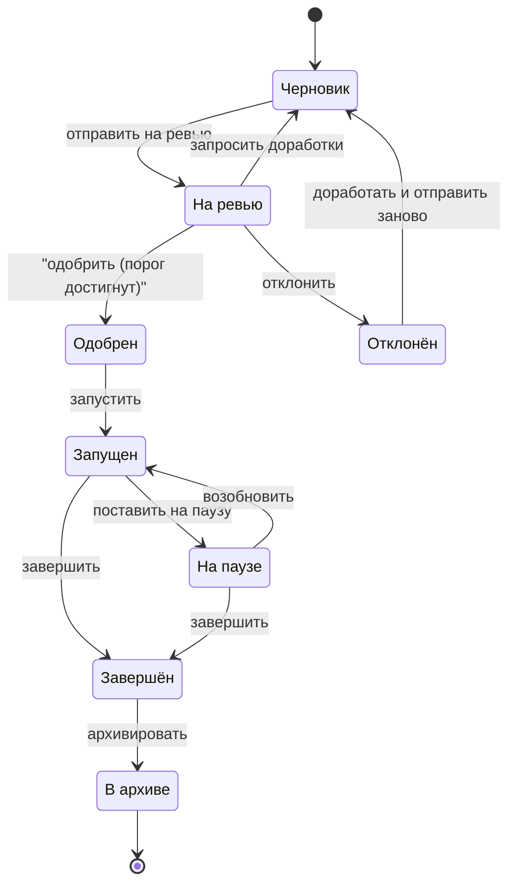

## 2.1 Цель

Эксперимент — это не просто "A/B". Это договор: кто запускает, на ком, что мерим, какие стоп‑сигналы и что делаем по итогу.
**Эксперимент** — это временная конфигурация, которая **подменяет значение конкретного feature flag** для части пользователей.
Эксперименты нужны, чтобы:
- проверять гипотезы (A/B/C/.../N),
- делать постепенные раскатки (rollout),
- управлять рисками через таргетинг и ревью,
- учитывать стоимость показов/экспозиций и конкуренцию за пользователя.

## 2.2 Ключевые сущности и параметры эксперимента

**В истории:** продакт формулирует гипотезу (“если поменяем кнопку — вырастет добавление в избранное”), описывает варианты A/B и сразу фиксирует метрики и guardrails, чтобы потом не спорить “а мы точно это мерили?”.

### Идентификация и принадлежность
- **идентификатор эксперимента** — уникальный идентификатор эксперимента.
- **ключ флага** — ключ флага, который “перекрывает” эксперимент.
- **название эксперимента** — человекочитаемое название.

### Статус и версия
- **состояние эксперимента** — черновик, на ревью, одобрен, запущен, на паузе, завершён, в архиве, отклонён.
- **версия конфигурации** — номер версии (стартует с 1) для отслеживания изменений. Нужно хранить все версии экспериментов.
- **доля аудитории эксперимента (тестового сегмента)** — какая часть пользователей включается в эксперимент.

> Пример: доля аудитории 20% значит, что эксперимент получит 20% пользователей; остальные 80% увидят «значение по умолчанию».

### Варианты
Эксперимент содержит один или более вариантов, каждый вариант:
- **название варианта** — идентификатор варианта (например, A/B).
- **значение варианта** — значение поддерживаемого типа, которое будет возвращаться продукту вместо «значение по умолчанию» флага.
- **вес варианта** — доля трафика на этот вариант.
- **признак контрольного варианта** — отметка варианта, используемого как базовая линия для сравнения (определяется аналитиком).

**Валидации вариантов:**
- сумма весов по всем вариантам должна совпадать с долей аудитории эксперимента;
- ровно один вариант должен быть контрольным.

### Таргетинг
- **правило участия** (опционально) — правило, определяющее, какие пользователи **могут** участвовать в эксперименте.

### Метрики эксперимента
- **целевая метрика** — основная метрика, по которой команда оценивает успех эксперимента.
- **набор метрик эксперимента** — целевые и вспомогательные метрики, которые задаются аналитиком в каталоге метрик.
- **метрики для аварийных тормозов** — метрики, на которые можно навешивать автоматические остановки/откаты.

Важно: платформа не должна хардкодить «единственный правильный» набор метрик.  
Метрики определяются как настраиваемые вычисления по входящим событиям (правила агрегации задаёт команда/аналитик).

### Аудит и контроль
- **история срабатываний guardrails** (опционально).
- **история ревью и решений** (опционально: кто/когда/что сделал).

## 2.3 Ограничения и инварианты

Эти ограничения нужны не "для бюрократии", а для того, чтобы в реальном продакшене не получалось: два эксперимента одновременно ломают один и тот же экран и потом никто не понимает, откуда эффект.

### 2.3.1 Единственность активного эксперимента на флаг
Для одного «ключ флага» одновременно может быть **не более одного** эксперимента в статусе:
- запущен или на паузе.

### 2.3.2 “Заморозка” после старта
После перехода в «запущен» или «на паузе» запрещено менять параметры, влияющие на:
- раздачу (варианты, веса, долю аудитории, правила участия),
- любые дополнительные параметры, которые влияют на выбор/выдачу варианта и конфликты.

## 2.4 Ревью

**В истории:** перед запуском техлид смотрит эксперимент как код‑ревью: нет ли конфликтов, корректны ли метрики, адекватен ли таргетинг, не забыли ли стоп‑метрики.

### Зачем
Ревью защищает от “случайного” запуска опасных экспериментов и вводит обязательный процесс согласования.

### Логика процесса
- Эксперимент в состоянии «черновик» можно редактировать.
- Действие «отправить на ревью» переводит эксперимент в состояние «на ревью».
- Назначенные аппруверы (Approver/Admin согласно правилам групп) могут:
  - одобрить — добавляет одобрение,
  - запросить доработки — возвращает в «черновик»,
  - отклонить — окончательно отклоняет эксперимент.

Эксперимент становится «одобрен», когда количество одобрений **≥ минимальный порог одобрений** для владельца (Experimenter).

## 2.5 Жизненный цикл эксперимента

**В истории:** никто не раскатывает сразу на 100%. Начинают с малого процента, следят за здоровьем, потом увеличивают — либо ставят на паузу, если что-то пошло не так.

### Состояния
- Черновик — редактируется.
- На ревью — ждёт ревью.
- Одобрен — прошёл ревью, готов к запуску.
- Запущен — активен, участвует в выдаче значений флага.
- На паузе — временно остановлен (не выдаёт значение как эксперимент), но сохраняет конфигурацию.
- Завершён — решение принято.
- В архиве — для истории.
- Отклонён — может быть переделан и отправлен заново.

## 2.6 Завершение эксперимента

**В истории:** финал — это не "красивый график", а решение: победителя раскатываем, проигравшего удаляем/откатываем, выводы сохраняем, чтобы не повторять ошибки.
При завершении поддерживаются бизнес‑режимы:

### Rollout winner
- Выбирается “победивший” вариант (например, `B`) и фиксируется комментарий/обоснование.
- Дальнейшая стратегия раскатки/закрепления результата выполняется на уровне продукта/процессов (эксперимент фиксирует решение).

### Rollback
- Фиксируется решение откатиться к контрольному/дефолтному поведению, плюс комментарий.

### No effect
- Фиксируется решение, что статистически и/или бизнес‑значимого эффекта не выявлено.
- Эксперимент закрывается с обязательным комментарием: почему принято решение и что делать с гипотезой дальше.

## 2.7 Таргетинг

**В истории:** продакт может сказать “только новые пользователи на iOS” — и это важно выразить как правило, которое одинаково понимают и UI, и бек, и аналитика.

### Что делает таргетинг
«правило участия» определяет, **какие пользователи потенциально могут участвовать** в эксперименте.
Если правило не задано — эксперимент потенциально применим ко всем пользователям (и ограничивается долей аудитории эксперимента).

### Логика условий
DSL поддерживает:
- логические операции: `AND`, `OR`, `NOT`;
- сравнения: `==`, `!=`, `IN`, `NOT IN`, `>`, `>=`, `<`, `<=`;
- типы значений: string/number/bool/date(YYYY‑MM‑DD).

**Правило отсутствующего атрибута:**

> Пример правила:
> страна входит в ["RU", "KZ"] И версия приложения >= "1.6.0" И платформа == "ios"

- если у пользователя нет нужного атрибута, сравнение считается **false** (пользователь не проходит условие).

## 2.8 Наблюдаемость и ответственность

**В истории:** если эксперимент сломал метрику, должно быть понятно, кто владелец, кто аппрувер и где смотреть, что произошло — иначе это всегда превращается в чат‑истерику.
Система должна хранить:
- историю ревью (кто, что, когда; решения и комментарии),
- историю срабатываний guardrails (если используется),
- версии изменений для прозрачности и аудита.

---
