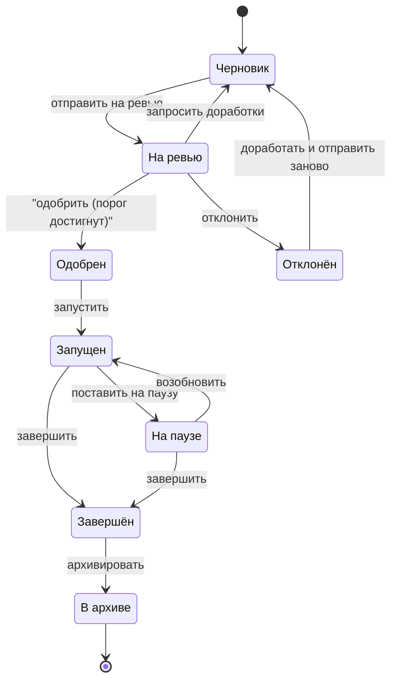

# LOTTY A/B Platform — ТЗ для участников

[[_TOC_]]

# Как читать это ТЗ

- Документ построен как **use-case постановка**: вы должны предложить архитектуру и реализацию, которая решает описанные сценарии.
- В ТЗ намеренно **не фиксируются конкретные API-контракты, алгоритмы и внутренняя архитектура**: это часть инженерного решения участника.
- Маркер **«В истории:»** — это сюжетный контекст/пример, который объясняет *какую проблему закрывает требование*. Это не требование само по себе.
  - Требования формулируются явно: **«Система должна…»**, **«Требование: …»**, **«Ожидание: …»**.
- Структура документа:
  - **Часть A** — контекст, цели и единая картина.
  - **Часть B** — основной функционал (обязательно).
  - **Часть C** — расширения и усложнения (на выбор участника).
  - **Часть D** — что считается результатом участника.

# Часть A. Контекст и постановка

## 📖 История Лотти

На третьем году существования олимпиады по промышленной разработке Лотти понял: хороший IT‑продукт нельзя «сделать один раз и забыть». Его нужно постоянно улучшать, но улучшать не на ощущениях, а опираясь на данные.

Однажды Лотти поспорил с продакт‑менеджером и предложил добавить в сервис подбора книг новую функцию. Продакт сомневался, но Лотти настоял: «Не волнуйся, я уверен, что пользователям понравится».

Команда потратила две недели на разработку и тестирование. После запуска стало ясно, что идея «не зашла»: пользователи начали оставлять негативные отзывы. Цена ошибки оказалась высокой, а уверенность в идее не помогла.

После этого Лотти больше не спорит на “кажется/не кажется”. В команде закрепилось простое правило:

> **Любая новая фича сначала проверяется экспериментом** на части аудитории.
> Затем команда принимает решение: **раскатываем победителя** или **откатываемся**.

Чтобы эксперименты можно было запускать часто и безопасно, Лотти хочет внутреннюю A/B‑платформу.
Вам нужно реализовать backend, который решает ключевые продуктовые проблемы:
- хранит **feature flags**: ключ, тип значения, значение по умолчанию;
- запускает **experiments** на этих флагах и раздаёт варианты по долям аудитории;
- отвечает продукту «что показать конкретному пользователю» в момент запроса;
- принимает события (показы/конверсии/ошибки/латентность) и строит отчёты;
- автоматически реагирует на деградации через guardrails;
- прозрачно разрешает конфликты, когда несколько команд тестируют изменения в одной зоне продукта.

---

## One-pager: A/B‑платформа Лотти — как это встраивается в приложение

Представьте, что команда делает экран с кнопкой «Купить». Возникает типичный спор: **какой цвет даст больше покупок — синий или красный?**
Лотти не хочет принимать решение «на вкус». Ему нужен ответ по бизнесу: *что приносит больше пользы и при этом не ухудшает продукт*.

Эта платформа нужна, чтобы пройти путь от идеи до решения спокойно и предсказуемо: показать вариант, собрать факты, принять решение и сохранить объяснение, почему так.

## Что именно мы делаем

Мы запускаем эксперимент: небольшой части пользователей показываем **вариант A**, другой части — **вариант B**, и сравниваем результат.
Результат — это не «красиво/некрасиво», а **метрика**: клики, покупки, регистрации, удержание.

Чтобы это работало, продукту нужны две способности:
1) получать значение флага и на его основе показывать правильный вариант;
2) отправлять в платформу события о том, что произошло после показа.

## Где это живёт в приложении

В продукте заранее есть место, где выбирается вариант поведения.
В примере ниже цвет кнопки управляется флагом `button_color`.

То есть в коде продукта есть простая логика:  
“Мне нужен цвет кнопки → возьму его из A/B‑платформы → нарисую кнопку таким цветом”.

Важно: продукт не анализирует и не считает статистику. Он просто:
- спрашивает “что показывать?”
- показывает
- отправляет “что произошло?”

## Как аналитик запускает эксперимент

Аналитик создаёт эксперимент на фича‑флаге `button_color`.
При создании он задаёт:
- варианты (например, `blue` и `red`);
- долю аудитории (например, 20%);
- метрику, по которой оцениваем эффект (например, «покупка» или «клик»).

С этого момента платформа готова отвечать приложению: кому какой цвет показывать.

## Что происходит, когда пользователь открывает экран

Вот пользователь открыл экран с кнопкой.

Приложение в этот момент делает очень простую вещь: просит у платформы значение фича‑флага.

### Мини‑пример
```python
personId = "u42"
defaultButtonColor = "green"

buttonColor = ab.getFeature(
    featureName="button_color",
    personId=personId,
    fallbackValue=defaultButtonColor,
)

renderButton(text="Купить", color=buttonColor)
```

Если пользователь попал в эксперимент, платформа вернёт “blue” или “red”.  
Если не попал — вернёт `default` значение флага.
В этом примере `default` для `button_color` — `green`.

Для Лотти это важно: эксперимент не требует отдельных релизов “под синий/красный”. Всё переключается настройками.

## Как платформа узнаёт, что было дальше

Показать вариант — половина дела. Нужно понять, **что случилось после**.

Поэтому приложение отправляет ивенты.  
Ивенты — это короткие сообщения вроде “кнопку показали” и “на кнопку нажали”.

### Мини‑пример
```python
# экран показали
ab.sendEvent("buttonShown", personId="u42", props={"screen": "checkout"})

# пользователь нажал кнопку
ab.sendEvent("buttonClicked", personId="u42", props={"screen": "checkout"})
```

Платформа собирает эти события и потом сравнивает:
в каком варианте кликов/покупок получилось больше.

## Guardrails: что если эксперимент случайно сделал хуже

Лотти не хочет, чтобы “проверка цвета” внезапно:
- увеличила ошибки,
- замедлила экран,
- уронила конверсию.

Поэтому у эксперимента есть guardrails — простая страховка.

Это правила вида:
“Если ошибок стало заметно больше — останови эксперимент”  
или “Если стало медленнее — останови эксперимент”.

Смысл один: **если стало опасно для продукта или бизнеса — эксперимент быстро выключается**.

## Что видит аналитик в конце

Когда прошло достаточно времени и накопились ивенты, аналитик открывает отчёт.

Там видно по каждому варианту:
- сколько людей увидели кнопку,
- сколько нажали,
- сколько дошли до целевого действия (например, покупки),
- не ухудшились ли ошибки и скорость.

Чтобы было совсем наглядно, отчёт обычно читается так:
“Синий вариант дал +X% к кликам, при этом ошибки не выросли → можно выкатывать всем”.  
Или:
“Красный дал больше кликов, но увеличил ошибки → лучше не выкатывать”.  
Или:
“Разницы нет → закрываем эксперимент и идём проверять другую гипотезу”.

В этот момент Лотти получает главное: **не спор, а решение на данных**.

## Одна схема, чтобы закрепить

```text
Аналитик создаёт эксперимент
        ↓
Приложение спрашивает “что показать?” → показывает вариант
        ↓
Приложение отправляет “что произошло?”
        ↓
Платформа следит за guardrails
        ↓
Платформа строит отчёт
        ↓
Лотти выбирает победителя и принимает решение
```

## Edge-case сценарии

Ниже — примеры ситуаций, которые платформа должна уметь обрабатывать. Здесь важно не «как именно реализовать», а какую проблему закрыть и как обеспечить воспроизводимость.

1. События приходят с задержкой и не по порядку.  
   Проблема: если считать «как прилетело», отчёт становится шумом и искажает воронку.  
   Пример: у части пользователей событие `buttonClicked` прилетает раньше `buttonShown` (ретраи, офлайн‑режим, сетевые задержки), а часть конверсий доезжает через несколько часов. Если обработка идёт только по времени приёма, одни конверсии теряются, другие ошибочно привязываются к неправильному показу.  
   Ожидание: аналитика устойчиво обрабатывает задержки и переупорядочивание событий, отчёт остаётся интерпретируемым и воспроизводимым при повторном пересчёте.

2. Эксперимент улучшает целевую метрику, но портит стабильность.  
   Проблема: «победа» по бизнес‑метрике может быть достигнута ценой ошибок и деградации, что делает такой результат неприемлемым для продакшена.  
   Пример: вариант `B` даёт рост CTR, но одновременно увеличивает долю ошибок и время ответа. Без ограничителей такой вариант может выглядеть «лучшим» только по одной метрике, хотя фактически ухудшает пользовательский опыт.  
   Ожидание: guardrails автоматически отслеживают критичные метрики и останавливают рискованный сценарий до массового ущерба, даже если целевая метрика формально растёт.

3. Несколько команд одновременно тестируют изменения в одной зоне продукта.  
   Проблема: конфликты смешивают эффекты и делают результаты необъяснимыми.  
   Пример: один аналитик проверяет цвет кнопки (`blue`/`green`), а другой одновременно проверяет текст на той же кнопке (`Купить`/`Оформить`). Если оба эксперимента идут параллельно в одной зоне, итоговый CTR нельзя однозначно объяснить: сработал цвет, текст или их комбинация.  
   Ожидание: конфликты решаются прозрачно и воспроизводимо, без «магии».

4. Один и тот же пользователь слишком часто попадает в эксперименты.  
   Проблема: если пользователь постоянно оказывается в «экспериментальном» сегменте, он видит нестабильный опыт, а данные становятся смещёнными.  
   Пример: Вася участвует в трёх экспериментах и каждый раз попадает в первые `30%` аудитории, получающей экспериментальное значение feature flag. В результате именно на нём непропорционально часто тестируются изменения, а «спокойного» базового опыта почти нет.  
   Ожидание: платформа ограничивает частоту и плотность участия одного пользователя в экспериментах, обеспечивает периоды обычного опыта и делает распределение воспроизводимым без систематического перекоса в пользу одних и тех же людей.
---

# Часть B. Основной функционал

Эта часть описывает обязательный минимум, по которому жюри проверяет работоспособность и воспроизводимость решения.

# 0. Доступ, роли и ревью

Проблема: у экспериментов не должно быть «владельца в вакууме». Если команда запускает рискованное изменение, должно быть понятно, кто обязан проверить и кто несёт ответственность за допуск к запуску.

## 0.1 Цель

Платформой пользуются разные типы пользователей:
- одни **создают и ведут эксперименты**,
- другие **проверяют и одобряют** перед запуском,
- третьи **смотрят результаты**,
- и есть те, кто **администрирует** правила и доступы.

Система должна обеспечивать **контроль доступа** и **обязательность ревью** там, где это требуется.
Здесь **ревью** — это проверка эксперимента перед запуском с итогом «одобрено» или «отклонено».

## 0.2 Роли и права

### Admin
- Управляет пользователями: создание, изменение, назначение ролей.
- Настраивает правила ревью (согласования перед запуском): кто может одобрять и сколько одобрений требуется.

### Experimenter
- Создаёт и ведёт эксперименты.
- Отправляет эксперименты на ревью и получает решение ревьюеров (одобрение или отклонение), при необходимости — комментарии и причины.

### Approver
- Ревьюит эксперименты.
- Может одобрять/отклонять в рамках своих полномочий.

### Viewer
- Доступ только на чтение: без создания, ревью и администрирования.


## 0.3 Аппрувер‑группы

Для каждого **Experimenter** система должна позволять настраивать:
- список **Approver**’ов, которые могут одобрять его эксперименты;
- **минимальный порог одобрений** — сколько аппруверов должно одобрить эксперимент до запуска.

### Сценарий без явно заданной аппрувер‑группы
Проблема: если для Experimenter не задана аппрувер‑группа, процесс ревью становится неоднозначным и может блокировать запуск эксперимента.

Требование: в таком сценарии система должна иметь однозначное и воспроизводимое fallback-поведение:
- кто может одобрять эксперимент;
- какой минимальный порог одобрений используется.

Граница свободы: конкретная модель fallback определяется участником, но должна быть явно описана в документации и подтверждаться на проверке.

---

# 1. Feature Flags

## 1.1 Цель

Лотти хочет, чтобы продукт мог “переключать” поведение **без нового релиза** и без ручных костылей — флаги становятся базовой ручкой управления.
Платформа должна позволять продукту получать значения параметров поведения (feature flags) по ключу в момент запроса.
Это нужно, чтобы:
- безопасно включать/выключать функциональность,
- запускать A/B‑эксперименты и постепенно раскатывать изменения,
- иметь предсказуемое поведение при отсутствии применимого эксперимента.

## 1.2 Что такое Feature flag

**В истории:** сначала команда заводит простой флаг для новой фичи (например, новый блок рекомендаций). Пока флаг выключен — всё как раньше. Когда включили на 1% — можно безопасно проверить, что ничего не взорвалось.
**Feature flag** — это:
- **ключ**: уникальный идентификатор флага, который знает продукт (код/конфиг);
- **значение по умолчанию**: значение, используемое, если эксперимент не применяется;
- **тип значения**: система должна поддерживать типизированные значения (как минимум string/number/bool).

Флаг — это “точка управления” в продукте: продукт запрашивает значение по ключу и использует полученное значение в логике.

## 1.3 Правила получения значения флага

**В истории:** продакт бесится, если у одного и того же пользователя “то так, то так”. Поэтому важно, чтобы платформа давала **детерминированный** ответ: одному пользователю — один вариант (если специально не меняли условия).
При запросе значения флага для конкретного пользователя:

1) Если **нет активного эксперимента**, влияющего на этот флаг — возвращается «значение по умолчанию».

2) Если есть активный эксперимент на этом флаге, но он **не применился** к пользователю (например, пользователь не попал в аудиторию/сегмент) — возвращается «значение по умолчанию».

3) Если активный эксперимент **применился** к пользователю — возвращается значение **выбранного для пользователя варианта**.

## 1.4 Управление флагами

**В истории:** Лотти не хочет править конфиги в проде руками. Флаг должен жить как нормальная сущность: создал → включил на сегмент → посмотрел → откатил, если плохо.
Платформа должна предоставлять возможность:
- **создавать** новые флаги (с ключом, типом значения и дефолтным значением),
- **просматривать** список и детали флагов, при желании — дополнительно хранить описание/владельца/метаданные (необязательно),
- **обновлять** только «значение по умолчанию» существующего флага.

Пример для связи с one-pager: флаг `button_color` может иметь значения `green` по умолчанию и экспериментальные варианты `blue`/`red`.

---
# 2. Experiments — бизнес-требования

## 2.1 Цель

Эксперимент — это не просто "A/B". Это договор: кто запускает, на ком, что мерим, какие стоп‑сигналы и что делаем по итогу.
**Эксперимент** — это временная конфигурация, которая **подменяет значение конкретного feature flag** для части пользователей.
Эксперименты нужны, чтобы:
- проверять гипотезы (A/B/C/.../N),
- делать постепенные раскатки (rollout),
- управлять рисками через таргетинг и ревью,
- учитывать стоимость показов/экспозиций и конкуренцию за пользователя.

## 2.2 Ключевые сущности и параметры эксперимента

**В истории:** продакт формулирует гипотезу (“если поменяем кнопку — вырастет добавление в избранное”), описывает варианты A/B и сразу фиксирует метрики и guardrails, чтобы потом не спорить “а мы точно это мерили?”.

### Идентификация и принадлежность
- **идентификатор эксперимента** — уникальный идентификатор эксперимента.
- **ключ флага** — ключ флага, который “перекрывает” эксперимент.
- **название эксперимента** — человекочитаемое название.

### Статус и версия
- **состояние эксперимента** — черновик, на ревью, одобрен, запущен, на паузе, завершён, в архиве, отклонён.
- **версия конфигурации** — номер версии (стартует с 1) для отслеживания изменений. Нужно хранить все версии экспериментов.
- **доля аудитории эксперимента (тестового сегмента)** — какая часть пользователей включается в эксперимент.

> Пример: доля аудитории 20% значит, что эксперимент получит 20% пользователей; остальные 80% увидят «значение по умолчанию».

### Варианты
Эксперимент содержит один или более вариантов, каждый вариант:
- **название варианта** — идентификатор варианта (например, A/B).
- **значение варианта** — значение поддерживаемого типа, которое будет возвращаться продукту вместо «значение по умолчанию» флага.
- **вес варианта** — доля трафика на этот вариант.
- **признак контрольного варианта** — отметка варианта, используемого как базовая линия для сравнения (определяется аналитиком).

**Валидации вариантов:**
- сумма весов по всем вариантам должна совпадать с долей аудитории эксперимента;
- ровно один вариант должен быть контрольным.

### Таргетинг
- **правило участия** (опционально) — правило, определяющее, какие пользователи **могут** участвовать в эксперименте.

### Метрики эксперимента
- **целевая метрика** — основная метрика, по которой команда оценивает успех эксперимента.
- **набор метрик эксперимента** — целевые и вспомогательные метрики, которые задаются аналитиком в каталоге метрик.
- **метрики для аварийных тормозов** — метрики, на которые можно навешивать автоматические остановки/откаты.

Важно: платформа не должна хардкодить «единственный правильный» набор метрик.  
Метрики определяются как настраиваемые вычисления по входящим событиям (правила агрегации задаёт команда/аналитик).

### Аудит и контроль
- **история срабатываний guardrails** (опционально).
- **история ревью и решений** (опционально: кто/когда/что сделал).

## 2.3 Ограничения и инварианты

Эти ограничения нужны не "для бюрократии", а для того, чтобы в реальном продакшене не получалось: два эксперимента одновременно ломают один и тот же экран и потом никто не понимает, откуда эффект.

### 2.3.1 Единственность активного эксперимента на флаг
Для одного «ключ флага» одновременно может быть **не более одного** эксперимента в статусе:
- запущен или на паузе.

### 2.3.2 “Заморозка” после старта
После перехода в «запущен» или «на паузе» запрещено менять параметры, влияющие на:
- раздачу (варианты, веса, долю аудитории, правила участия),
- любые дополнительные параметры, которые влияют на выбор/выдачу варианта и конфликты.

## 2.4 Ревью

**В истории:** перед запуском техлид смотрит эксперимент как код‑ревью: нет ли конфликтов, корректны ли метрики, адекватен ли таргетинг, не забыли ли стоп‑метрики.

### Зачем
Ревью защищает от “случайного” запуска опасных экспериментов и вводит обязательный процесс согласования.

### Логика процесса
- Эксперимент в состоянии «черновик» можно редактировать.
- Действие «отправить на ревью» переводит эксперимент в состояние «на ревью».
- Назначенные аппруверы (Approver/Admin согласно правилам групп) могут:
  - одобрить — добавляет одобрение,
  - запросить доработки — возвращает в «черновик»,
  - отклонить — окончательно отклоняет эксперимент.

Эксперимент становится «одобрен», когда количество одобрений **≥ минимальный порог одобрений** для владельца (Experimenter).

## 2.5 Жизненный цикл эксперимента

**В истории:** никто не раскатывает сразу на 100%. Начинают с малого процента, следят за здоровьем, потом увеличивают — либо ставят на паузу, если что-то пошло не так.

### Состояния
- Черновик — редактируется.
- На ревью — ждёт ревью.
- Одобрен — прошёл ревью, готов к запуску.
- Запущен — активен, участвует в выдаче значений флага.
- На паузе — временно остановлен (не выдаёт значение как эксперимент), но сохраняет конфигурацию.
- Завершён — решение принято.
- В архиве — для истории.
- Отклонён — может быть переделан и отправлен заново.



## 2.6 Завершение эксперимента

**В истории:** финал — это не "красивый график", а решение: победителя раскатываем, проигравшего удаляем/откатываем, выводы сохраняем, чтобы не повторять ошибки.
При завершении поддерживаются бизнес‑режимы:

### Rollout winner
- Выбирается “победивший” вариант (например, `B`) и фиксируется комментарий/обоснование.
- Дальнейшая стратегия раскатки/закрепления результата выполняется на уровне продукта/процессов (эксперимент фиксирует решение).

### Rollback
- Фиксируется решение откатиться к контрольному/дефолтному поведению, плюс комментарий.

### No effect
- Фиксируется решение, что статистически и/или бизнес‑значимого эффекта не выявлено.
- Эксперимент закрывается с обязательным комментарием: почему принято решение и что делать с гипотезой дальше.


## 2.7 Таргетинг

**В истории:** продакт может сказать “только новые пользователи на iOS” — и это важно выразить как правило, которое одинаково понимают и UI, и бек, и аналитика.

### Что делает таргетинг
«правило участия» определяет, **какие пользователи потенциально могут участвовать** в эксперименте.
Если правило не задано — эксперимент потенциально применим ко всем пользователям (и ограничивается долей аудитории эксперимента).

### Логика условий
DSL поддерживает:
- логические операции: `AND`, `OR`, `NOT`;
- сравнения: `==`, `!=`, `IN`, `NOT IN`, `>`, `>=`, `<`, `<=`;
- типы значений: string/number/bool/date(YYYY‑MM‑DD).

**Правило отсутствующего атрибута:**

> Пример правила:
> страна входит в ["RU", "KZ"] И версия приложения >= "1.6.0" И платформа == "ios"

- если у пользователя нет нужного атрибута, сравнение считается **false** (пользователь не проходит условие).

## 2.8 Наблюдаемость и ответственность

**В истории:** если эксперимент сломал метрику, должно быть понятно, кто владелец, кто аппрувер и где смотреть, что произошло — иначе это всегда превращается в чат‑истерику.
Система должна хранить:
- историю ревью (кто, что, когда; решения и комментарии),
- историю срабатываний guardrails (если используется),
- версии изменений для прозрачности и аудита.

---

# 3. Runtime Decide — как продукт узнаёт “что показывать”

## 3.1 Цель

Decision API — это тот самый момент, когда продукт спрашивает: “какой вариант показать этому пользователю прямо сейчас?”.
Платформа должна предоставлять продукту механизм **получения актуальных значений флагов** для конкретного пользователя/устройства **в момент показа UI**.

Смысл запроса со стороны продукта:
> “Вот субъект (пользователь или устройство) и его атрибуты.  
> Дай значения для этих флагов так, как будто мы показываем интерфейс прямо сейчас”.

## 3.2 Входные данные

**В истории:** при открытии экрана продукт передаёт информацию о пользователе, какой контекст (платформа, страна, версия, экран) — чтобы таргетинг и разрезы работали честно.
При обращении продукт передаёт:

- **идентификатор субъекта** — стабильный идентификатор субъекта (например, идентификатор пользователя или устройства), по которому обеспечиваются:
  - предсказуемая раздача трафика,
  - «липкость» к варианту (stickiness) в рамках эксперимента.
- **атрибуты субъекта** — набор атрибутов (страна, версия приложения и т.п.), которые используются для таргетинга («правило участия»).
- **список запрошенных флагов** — список ключей флагов, значения которых нужны продукту для рендера.

## 3.3 Выходные данные

**В истории:** в ответ продукт получает «вот твой вариант + служебный «идентификатор решения»». Этот «идентификатор решения» потом связывает показ и события (клики/покупки) в одну цепочку.
Для каждого запрошенного флага возвращается решение «что применить»:

- итоговое значение, которое продукт должен использовать;
- служебный идентификатор решения, чтобы связать показ и последующие события;
- если значение выдано экспериментом: идентификатор эксперимента и выбранный вариант.
## 3.4 Правила принятия решения

Здесь важно, чтобы правила были простыми и прозрачными: продакт должен понимать, почему пользователь попал в вариант B, а не в A.
Для каждого «ключ флага» платформа должна определить итоговое значение так:

1) Если **нет применимого активного эксперимента** (эксперимент не запущен/на паузе или не применился) — вернуть **значение по умолчанию** флага.

2) Если есть активный эксперимент на этом флаге и он применим к субъекту:
- применить **таргетинг**
- выбрать **вариант** согласно весам вариантов
- вернуть значение выбранного варианта и метаданные эксперимента.

## 3.5 Требуемые свойства качества

**В истории:** это тот самый “не прыгать между вариантами”. Если пользователь вчера видел B, а сегодня внезапно увидел A — эксперимент превращается в шум.

### 3.5.1 Детерминизм
Одинаковый запрос при **неизменной конфигурации** (флаги/эксперименты/статусы/правила) должен возвращать **одинаковый результат**.

Цель: предсказуемость UI, корректная аналитика и воспроизводимость.

### 3.5.2 Stickiness
Один и тот же «идентификатор субъекта» не должен “прыгать” между вариантами **в рамках одного эксперимента**, пока конфигурация эксперимента не меняется.

Цель: честное сравнение, пользовательский опыт без дерганий, чистая статистика.

### 3.5.3 Иные сбои

Сеть — штука капризная: запросы и события могут теряться или дублироваться. Поэтому **идемпотентность** и дедупликация — обязательны.

## 3.6 Защита пользователя от постоянного участия в экспериментах

**В истории:** пользователь не должен быть «вечным подопытным кроликом», который постоянно живёт в тестовых вариантах.

Платформа должна поддерживать политику участия пользователя в экспериментах:
- ограничение интенсивности участия (сколько активных экспериментов одновременно может влиять на одного субъекта);
- периоды «отдыха» (cooldown), когда после серии экспериментов пользователь чаще видит базовое поведение;
- прозрачные правила приоритезации, если на пользователя претендуют несколько экспериментов.

Важно: конкретный алгоритм квот/ротации не фиксируется в ТЗ, но решение участника должно объяснять, как выполняется эта пользовательская защита.

## 3.7 Технические проверки живости и готовности

Проблема, которую закрывает этот раздел: без разделения живости и готовности невозможно понять, сервис уже обслуживает запросы или только запущен как процесс.

- `/health` отвечает `200`, когда процесс приложения жив и может обрабатывать базовые служебные проверки.
- `/ready` отвечает `200`, когда приложение готово принимать запросы.
- Пока критичные зависимости не готовы, `/ready` должен отвечать не-`200`.
- После старта системы `/ready` должен перейти в `200` не позднее чем за `180` секунд; если этого не произошло, жюри вправе запускать проверки в текущем состоянии системы.
- Поведение `health/readiness` должно быть отражено в инструкции запуска и в сценарии демонстрации.

--- 

# 4. Events — как продукт сообщает “что произошло”

## 4.1 Цель

События — это способ превратить “кажется стало лучше” в измеримые данные: что показали, что нажали, что купили, что сломалось.
Механизм принятия решения отвечает на вопрос “**что нужно показать**” (какие значения флагов применить).
Чтобы считать метрики, контролировать качество и списывать стоимость показов, платформа должна принимать от продукта события о том, **что реально произошло после решения**.

Ключевой принцип: **все события должны быть связаны с конкретным решением выдачи через «идентификатор решения».**

## 4.2 Типы событий

В платформе **нет “зашитого навсегда” списка событий**.  
События — это договор между продуктом и платформой, и этот договор можно **расширять через админку**.

### 4.2.1 Каталог событий
В админке поддерживается каталог типов событий:
- можно **создавать / редактировать / архивировать** «тип события»;
- для каждого типа задаются метаданные: человекочитаемое имя/описание, обязательные дополнительные параметры, правила валидации и то, как событие участвует в отчётах/алертах.

Backend использует каталог для:
- **валидации** входящих событий (чтобы “левые” типы не ломали аналитику),
- **нормализации** (одинаковые названия/поля для всех команд),
- **маршрутизации** в хранение/стрим (чтобы дальше отчёты и уведомления работали предсказуемо).

### 4.2.2 Стандартные и пользовательские события
Чтобы платформа работала “из коробки”, в каталоге **может** быть заведён минимальный базовый набор (например, событие «экспозиция» как факт показа — он нужен для корректной атрибуции).  
А всё остальное — **пользовательские события** под конкретную фичу:  
«просмотр экрана», «клик по кнопке», «добавление в избранное», «успешная покупка» — любые, которые вам реально нужно мерить.

**Как это выглядит в лоре:** продакт говорит Лотти “хочу понять, стали ли люди чаще добавлять книгу в избранное”.  
Лотти заводит в админке тип события «клик по добавлению в избранное» (и ещё тип события «просмотр карточки книги») — и после этого продукт/бек начинает слать эти события, а платформа принимает их по общим правилам.

## 4.3 Идентификация и дедупликация

**В истории:** приложение может ретраить отправку (интернет упал), поэтому платформа должна уметь не считать одно и то же событие дважды.

Сложно построить аналитику, если одно событие будет засчитано несколько раз — нужно предусмотреть механизмы защиты от этого.

## 4.4 Атрибуция

### 4.4.1 “Считаем только то, что реально показали”
Боль, которую Лотти уже ловил на прошлых релизах: если считать “конверсии” без факта показа — метрики становятся мусором.

Поэтому в каталоге событий (см. 4.2) для каждого «тип события» задаётся политика атрибуции, например:
- правило «требует факта показа» — событие учитывается только если по тому же «идентификатор решения» есть факт показа (обычно это событие категории «экспозиция»).

Важно: какие именно типы требуют факта показа, не зашито в коде.  
Команда настраивает это в админке: для кликов/покупок/ошибок/латентности обычно включает это требование, а для технических/фоновых событий — нет.

### 4.4.2 События могут приходить не по порядку
Платформа должна корректно работать, если события приходят **не по порядку**.

Типичный кейс из жизни: событие «клик по добавлению в избранное» прилетело раньше, чем событие «экспозиция» (сеть/батч/ретраи).
Считаем, что более старое событие придёт не позднее, чем через 7 дней после более нового.

## 4.5 Требования к приёму и ответу

**В истории:** продукту важно быстро понять “приняли событие или нет”, чтобы не держать очередь бесконечно и не забивать сеть.
При приёме пачки событий платформа должна:
- принять валидные события,
- посчитать, сколько:
  - **принято** — принято и учтено/поставлено в ожидание атрибуции,
  - **дубликатов** — повтор по «идентификатор события»,
  - **отклонено** — невалидный формат, неизвестный тип, нет обязательных полей и т.д.,
- вернуть список ошибок по отклонённым элементам.

---

# 5. Reports — как продакт‑менеджер видит результат

## 5.1 Цель

Отчёты — это место, где продакт наконец перестаёт спорить с разработкой и дизайнером: “сработало или нет?”.
Платформа должна давать продакт‑менеджеру и команде **сводный отчёт по эксперименту**, чтобы:
- оценить эффект вариантов на целевые метрики,
- сравнить качество и производительность (на выбранных метриках),
- принять решение о раскатке победителя или откате.

Отчёт строится по событиям, пришедшим от продукта и атрибутированным к эксперименту/варианту через «идентификатор решения».

## 5.2 Окно отчёта

**В истории:** продакт заранее фиксирует, за какой период мы смотрим эффект, чтобы потом не было “давай ещё недельку подождём, вдруг вырастет”.
Метрики считаются в заданном временном окне:
- от начала периода (включительно) до конца периода (не включительно).

## 5.3 Единица агрегации

**В истории:** если один пользователь может сделать 10 кликов, важно понимать, считаем ли мы “клики” или “пользователей, которые кликнули”.
Отчёт строится:
- **по эксперименту в целом**, и
- **по каждому варианту** эксперимента отдельно («идентификатор варианта»).

## 5.4 Набор метрик

**В истории:** для гипотезы про “избранное” команда выбирает основную метрику (например, доля пользователей, добавивших в избранное) и пару guardrails (ошибки/латентность), чтобы не выиграть ценой поломки.

### 5.4.1 Каталог метрик
Платформа должна поддерживать **настраиваемые метрики**, которые аналитик может заводить в админке:
- задавать уникальный идентификатор, название и назначение метрики;
- задавать правило вычисления по событиям (какие события и как агрегируются);
- задавать условия атрибуции (например, требовать подтверждённый факт показа для части метрик).

### 5.4.2 Что считается в отчёте
Для каждого варианта в отчёте показываются:
- значения метрик, выбранных для конкретного эксперимента (основная и дополнительные);
- контекст расчёта (окно, атрибуция, единица агрегации);
- динамика метрик в выбранном диапазоне времени.

Важно: метрики не должны быть «зашиты в коде навсегда».  
У разных команд и гипотез набор целевых/защитных метрик может отличаться.

### 5.4.3 Базовые примеры метрик
Платформа **может** поддерживать метрики из коробки как референс:
- число показов, число конверсий, «доля конверсий»;
- число ошибок, «доля ошибок»;
- «средняя задержка», «95-й перцентиль задержки».

Это примеры, а не закрытый перечень.

---

# 6. Guardrails — автоматический стоп эксперимента

## 6.1 Цель

Guardrails — это страховка: эксперимент может “побеждать” по целевой метрике и одновременно ломать продукт. Это нельзя пропускать.
Иногда эксперимент улучшает целевую метрику (например, конверсию), но при этом ухудшает **стабильность** или **производительность**: растут ошибки или задержки.

**Guardrails** — это правила безопасности, которые автоматически **останавливают** или **откатывают** эксперимент при деградации, чтобы ограничить ущерб для пользователей и бизнеса.

## 6.2 Что такое guardrail

**В истории:** если заметно выросла задержка или количество ошибок увеличилось — эксперимент должен остановиться автоматически, без героизма и ручного мониторинга.
Guardrail — это правило, которое определяется четырьмя параметрами:

- **метрика безопасности** — выбранная метрика из каталога метрик эксперимента;
- **порог** — значение, после превышения которого считаем, что есть деградация.
- **окно наблюдения** — окно наблюдения (например, “последние 10 минут”), за которое пересчитывается метрика.
- **действие при срабатывании**:
  - поставить эксперимент на паузу,
  - «откат к контрольному варианту» — откатить эксперимент к контрольному варианту.

Примеры guardrail-метрик: «доля ошибок», «95-й перцентиль задержки», пользовательские quality-метрики, если они описаны в каталоге.

## 6.3 Как работает проверка

Здесь важна человеческая логика: guardrail — это правило уровня “если стало хуже, чем порог — сделай действие”, а не просто график в дашборде.
Пока эксперимент находится в запущенном состоянии, платформа периодически проверяет guardrails:

1) Накапливаются и атрибутируются события, нужные для расчёта соответствующих guardrail-метрик по решениям («идентификатор решения») этого эксперимента.
2) На каждом шаге проверки платформа пересчитывает выбранную guardrail-метрику **за последние «окно наблюдения»**.
3) Если значение метрики превышает порог — считается, что guardrail **сработал**, и платформа выполняет выбранное действие.

Цель: автоматическая реакция в близком к real‑time режиме без участия человека.

## 6.4 Действия при срабатывании

**В истории:** минимальный набор действий — поставить на паузу и уведомить. Дальше уже команда решает: откатываем или фиксим.

### 6.4.1 Действие = пауза
Платформа переводит эксперимент в состояние «на паузе».
Бизнес‑смысл: остановить раздачу экспериментального значения и прекратить дальнейшее ухудшение, сохранив возможность ручного анализа и последующего решения.

### 6.4.2 Действие = откат к контрольному варианту
Платформа выполняет откат к контрольному варианту.
Бизнес‑смысл: быстро вернуть базовое (ожидаемое) поведение.

> Важно: точная трактовка “rollback” должна быть единообразной в продукте. На бизнес‑уровне это означает прекращение выдачи деградирующего варианта и возвращение к базовому варианту эксперимента (control). Как именно это выражается в статусах/выдаче — реализационная деталь.

## 6.5 Фиксация факта срабатывания

**В истории:** потом всегда спрашивают “почему выключили?”. Поэтому нужен аудит: что сработало, когда, по каким данным.
Когда guardrail срабатывает, платформа обязана:

1) Выполнить выбранное действие (пауза или откат к контрольному варианту).

2) Добавить запись в историю срабатываний guardrails со следующими полями:
- метрика
- порог
- «окно наблюдения»
- действие
- «фактическое значение метрики» — фактическое значение метрики на момент срабатывания
- «время срабатывания» — время срабатывания

---

# Часть C. Расширения и усложнения

Эта часть — опциональные расширения. Они не заменяют обязательный минимум из части B и оцениваются отдельно по правилам критериев.

# 7. Платформа уведомлений — быстрее реагировать на то, что происходит

## 7.1 Цель

Уведомления — чтобы важное происходило не только в UI платформы, а там, где команда реально это увидит.
Команде нужно **быстро узнавать**, что происходит с экспериментами, без постоянного ручного мониторинга.
Платформа уведомлений должна:
- оперативно сообщать о **важных событиях** (алерты) и **информационных апдейтах**;
- доставлять сообщения в **разные мессенджеры/каналы** (много форматов);
- позволять настраивать “кому/куда/когда” отправлять уведомления.

## 7.2 События и триггеры

**В истории:** продакту важно знать про старт/паузы/окончание эксперимента, а Лотти — про срабатывание guardrails и ошибки интеграций.

- Жизненный цикл эксперимента
- Guardrails (аварийные тормоза)
- Данные/качество/производительность

## 7.3 Каналы доставки
Платформа должна уметь доставлять уведомления в разные каналы — потому что у разных команд разные рабочие привычки и ограничения.

Но **делать “все мессенджеры мира” не нужно**.

### 7.3.1 Требование для MVP
Сделать **2–3 канала доставки** (минимум 2) по примеру реальных интеграций:
- Telegram
- Slack
- (опционально) Email / Discord / Голубиный протокол

Остальные перечисленные каналы — **примеры расширения**, их можно добавить позже без переписывания бизнес‑логики.

### 7.3.2 Архитектурное ожидание
Чтобы новые каналы добавлялись быстро, система должна иметь единый формат сообщения и единый набор обязательных полей для отправки.

**Как это выглядит в лоре:** когда guardrail срабатывает и эксперимент ставится на паузу, Лотти не хочет узнавать об этом “завтра в дашборде”.  
Он хочет, чтобы уведомление сразу прилетело в командный чат — туда, где команда реально живёт.

## 7.4 Настройка правил уведомлений

**В истории:** один и тот же триггер может быть важен разным людям по‑разному: продакту — итоговые метрики, инженерам — алерты, аналитикам — качество данных.
Платформа должна позволять конфигурировать правила уведомлений:

Каждое правило включает:
- **источник** (эксперимент/флаг/владелец/аккаунт/все эксперименты),
- **событие/условие** (например, сработал guardrail или эксперимент ушёл на ревью),
- **фильтры** (severity, конкретные метрики, окно времени, окружение prod/stage),
- **получатели** (каналы/группы/пользователи),
- **порог частоты** (rate limit) и дедупликация
- **шаблон** сообщения (если нужно кастомизировать).

## 7.5 Шумоподавление: дедуп, rate limit, группировка

**В истории:** если платформа заспамит чат, её просто выключат. Поэтому дедуп/группировка — не "хотелка", а выживание.
Важно, чтобы уведомления не превращались в спам.

---

# 8. Experiment Insights UI — визуализация репортов

## 8.1 Цель

Контроль качества данных нужен для того, чтобы экспериментам доверяли. Без него любой отчёт превращается в "верю/не верю".
Команде нужно **быстро понять**, что происходит с экспериментом: есть ли эффект, нет ли деградации, достаточно ли данных, когда и почему всё изменилось.

UI/дашборды должны:
- ускорять принятие решений (rollout / rollback / продолжать);
- помогать в расследованиях (почему метрика “поехала”);
- снижать риск неправильных выводов за счёт контекста и “здоровья данных”.

## 8.2 Качество данных эксперимента

**В истории:** если продукт вдруг перестал слать события факта показа или события приходят с дырками, продакт должен увидеть это сразу, иначе он сделает неправильный вывод.
Чтобы не принимать решение по “битым” данным, UI должен отображать:
- долю отклонённых событий и причины (топ причин);
- долю дубликатов;
- долю событий конверсии/ошибок/задержки, которые временно не дождались экспозиции (или наоборот — степень полноты атрибуции);
- задержку доставки событий — если собирается;
- перекос трафика: фактическое распределение показов по вариантам против ожидаемого по весам (как предупреждение).

## 8.3 Сегментация и разрезы

**В истории:** общий эффект может быть ноль, но на "новичках" плюс, а на "старичках" минус. Разрезы — способ не пропустить такие штуки.
В отчёте должна быть возможность быстро переключать разрезы:
- по стране, версии приложения, платформе, экрану (из атрибутов события) и другим важным признакам.

Требование: сегментация не должна ломать базовый UX — по умолчанию пользователь видит общий результат, а разрезы подключает при необходимости.

## 8.4 Экспорт и шаринг

**В истории:** продакт идёт на демо/встречу и кидает ссылку на отчёт — чтобы не пересылать скрины и не спорить “у меня другое число”.
- Экспорт графиков/таблицы (CSV / изображение / ссылка на диапазон времени).
- Постоянная ссылка на эксперимент с выбранным окном и метрикой (для обсуждения в чатах/тикетах).

---

# 9. Learnings Library — база знаний и поиск похожих экспериментов

## 9.1 Цель

Библиотека экспериментов — это память команды: чтобы через полгода не запускать тот же эксперимент второй раз “как будто впервые”.
Эксперименты заканчиваются, выводы теряются, команды повторяют одни и те же тесты.
Нужна библиотека знаний, которая:
- сохраняет “что пробовали и чем закончилось”;
- помогает находить **похожие эксперименты** (по фиче/аудитории/метрикам/настройкам);
- ускоряет планирование новых экспериментов и снижает риск повторения ошибок.

## 9.2 Что хранится как “learning”

**В истории:** после завершения эксперимента продакт фиксирует “что пробовали, что получилось, что не получилось и почему”. Это потом экономит недели.
Для каждого эксперимента (особенно при завершении) хранится структурированная запись:

- **Гипотеза**: что хотели улучшить и почему.
- **Основная метрика**: по какой метрике судим успех (например, доля конверсий).
- **Использованные guardrails**: какие пороги стояли.
- **Результат**:
  - победитель / отсутствие эффекта / ухудшение,
  - что сделали: rollout / rollback / продолжить/повторить.
- **Контекст и сегмент**:
  - «ключ флага», продуктовая зона (теги), таргетинг (в кратком виде),
  - платформа/страны/версии, если критично.
- **Ссылки**:
  - ссылка на report/дашборд,
  - ссылка на тикет/PRD (если есть).
- **Заметки**: короткие инсайты “почему так вышло”.

Минимальное ожидание: запись не должна быть “простынёй”, лучше 5–10 строк, но **обязательная**.

## 9.3 Поиск и фильтры

**В истории:** когда появляется новая гипотеза, первый шаг — найти, не делали ли уже похожее по этому флагу/экрану/метрике.
Библиотека должна поддерживать:
- полнотекстовый поиск (по названию, гипотезе, заметкам, тегам);
- фильтры: ключ флага, команда/владелец, статус результата, дата, страны/платформы, основная метрика.

## 9.4 “Найти похожие эксперименты”

**В истории:** продакт не хочет начинать с нуля — он открывает похожие кейсы и копирует рабочий шаблон (и наоборот — избегает повторения фейла).
### 9.4.1 Что считается похожестью
Система должна уметь предлагать список похожих экспериментов по комбинации признаков:
- тот же «ключ флага» или близкая функциональная зона (по тегам);
- схожие аудитории (похожие правило участия: страны/версии/платформа);
- схожий тип изменения (например, “алгоритм поиска”, “UI баннер”, “латентность‑чувствительное”);
- схожие метрики/guardrails;
- схожая структура вариантов (A/B/n, rollout, веса).
- иные варианты, которые считаются адекватными

### 9.4.2 Выход "похожих"
Для каждого найденного эксперимента показываются:
- краткий итог (rollout/rollback/no effect),
- эффект по основной метрике,
- риски (были ли guardrail triggers),
- ссылка на графики и learning‑summary.

Цель: перед запуском нового эксперимента PM видит “мы уже такое делали, вот чем закончилось”.

## 9.5 Качество данных библиотеки

Если библиотека превращается в помойку без тегов/описаний — она перестаёт работать. Поэтому качество "learnings" тоже нужно поддерживать.
- Изменения и редактирование learnings должны быть аудируемыми (кто/когда).
- Для экспериментов без заполненного learning показывать “пусто/нужно заполнить” и не давать закрыть процесс формально (если включена политика).

## 9.6 Пользовательские сценарии
- PM создаёт новый эксперимент → нажимает “похожие” → читает 3–5 релевантных кейсов → копирует удачный шаблон.
- Команда делает пост‑мортем guardrail trigger → быстро находит все эксперименты, где срабатывал «95-й перцентиль задержки».
- Новый сотрудник изучает “что делали по поиску за год” по ключ флага/тегу.

---

# 10. Autopilot Ramp‑up — умная автопилот‑раскатка

## 10.1 Цель

Autopilot ramp‑up — чтобы раскатка была не на “чуйке”, а по понятным правилам и с автоматической безопасностью.
Ручная раскатка по доля трафика эксперимента медленная и рискованная. Нужен автопилот, который:
- ускоряет получение данных,
- автоматически повышает трафик, когда всё хорошо,
- автоматически тормозит/останавливает, когда плохо,
- делает процесс **прозрачным** (понятно почему шагнули/поставили на паузу).

## 10.2 Что такое ramp‑plan

**В истории:** команда заранее решает: 1% → 5% → 25% → 50% → 100%, и что должно быть “окей” на каждом шаге.
Ramp‑plan — конфигурация, прикреплённая к эксперименту, которая определяет:
- **ступени трафика** (например, 1% → 5% → 10% → 25% → 50% → 100%);
- **условия перехода** на следующую ступень (gates);
- **условия экстренной реакции** (safety actions);
- **минимальные требования к данным** (data sufficiency);
- **окна наблюдения** для проверки.

## 10.3 Gates: “когда можно увеличивать”

**В истории:** если DQ зелёный и guardrails не горят — можно увеличить. Если горят — стоп.
Для каждого шага автопилот должен проверять, что:

### 10.3.1 Достаточно данных
Примеры критериев (настраиваемые):
- общее число показов >= X за окно,
- число показов на вариант >= Y (для A/B/n),
- прошло минимум T минут на текущей ступени.

### 10.3.2 Безопасность
- guardrails не сработали;
- доля ошибок и latency (avg/p95) находятся в пределах порогов (могут быть отдельные “ramp‑пороги”, мягче/жёстче, чем guardrails).

### 10.3.3 Здоровье данных
- нет критических предупреждений Data Quality (например, SRM/перекос, массовые rejected events).

Если gates выполнены — переход на следующую ступень.

## 10.4 Safety actions: “что делать, если плохо”

**В истории:** это как аварийная кнопка: что именно делаем автоматически, чтобы не ждать, пока кто-то заметит.
Автопилот должен уметь действовать по политике:

- **автоматическая пауза** — поставить эксперимент на паузу и уведомить.
- **автоматический откат к контролю** — откатить к контролю (если такой режим поддержан).
- **шаг назад по трафику** — откатиться на предыдущую ступень traffic (например, с 25% обратно на 10%) и дать время стабилизироваться.

Выбор действия задаётся в ramp‑plan и может отличаться по уровню критичности.

## 10.5 Прозрачность и управляемость

**В истории:** продакт и инженер должны понимать, на каком шаге раскатка сейчас, почему остановилась и кто это сделал.
### 10.5.1 Автопилот не должен быть “чёрным ящиком”
Система обязана фиксировать историю “решений автопилота”:
- текущая ступень,
- когда и почему перешли,
- какие метрики/пороги проверяли,
- что именно нарушилось при остановке.

### 10.5.2 Ручное вмешательство
Админ/владелец (при наличии прав) может:
- временно остановить автопилот (manual mode),
- перезапустить автопилот,
- пропустить ступень (override) — опционально, под аудит.

---

# 11. Разруливание конфликтующих экспериментов

## 11.1 Цель

Конфликты — неизбежны: разные эксперименты могут хотеть менять одно и то же. Платформа должна решать это предсказуемо.
В реальной жизни эксперименты могут **конфликтовать**:
- два эксперимента меняют одну и ту же пользовательскую “поверхность” (UI/алгоритм) разными путями;
- разные команды запускают тесты, которые нельзя одновременно показывать одному пользователю;
- несколько экспериментов претендуют на один и тот же “показ” (и бюджет/метрики смешиваются).

Нужна система, которая:
- делает конфликты **явными** до запуска,
- обеспечивает **детерминированное** решение при выдаче значений,
- сохраняет корректную атрибуцию событий и понятный аудит.

## 11.2 Типы конфликтов

**В истории:** одновременно тестируют "новую кнопку" и "новый блок рекомендаций", и оба трогают один экран — нужно понять, что с чем конфликтует.
### 11.2.1 Конфликт на одном флаге
Один «ключ флага» не должен одновременно иметь более одного активного эксперимента. Это базовая защита.

### 11.2.2 Конфликт “на поверхности”
Даже если флаги разные, эксперименты могут менять один и тот же экран/алгоритм и мешать друг другу.
Пример: один эксперимент меняет сортировку, другой — выдачу баннера, но оба влияют на общую конверсию так, что метрики неинтерпретируемы.

### 11.2.3 Конфликт “взаимоисключение”
Есть классы экспериментов, которые нельзя показывать одному субъекту одновременно:
- два разных дизайна checkout,
- две разные модели цены,
- два разных “больших” изменения в одной зоне.


## 11.3 Модель конфликтных доменов

Это способ объяснить конфликт не инженерам, а людям: "вот зона продукта, которую этот эксперимент трогает".
Каждый эксперимент может (опционально) объявлять:
- **список конфликтных доменов** — группы конфликтов (например, checkout, search ranking, home banner).
- **политика конфликта** — как вести себя при конфликте (см. 11.4).

Бизнес‑смысл: домен — это “поверхность”, где одновременно может быть активен только один эксперимент для данного субъекта.

## 11.4 Политики разрешения конфликтов

**В истории:** если пользователь попал сразу в два конфликтующих эксперимента, платформа должна выбрать вариант по политике (приоритет/рандом/победитель).
Когда механизм принятия решения для одного «идентификатор субъекта» обнаруживает несколько применимых экспериментов в одном домене, система должна выбрать стратегию:

### 11.4.1 Mutual exclusion
- Разрешён только **один** эксперимент в домене.
- Остальные считаются “не применившимися” (fallback на значение по умолчанию для их флагов или отсутствие их влияния).
- Выбор победителя — детерминированный (см. 11.5).

### 11.4.2 Конкурентный выбор по ставке
- Если у экспериментов задана ставка, домен может разрешать выбор победителя "по ставке".
- Выбранный победитель получает право "показаться" субъекту, остальные проигрывают.
- Это полезно, когда эксперименты представляют разные "кампании" или конкурируют за ограниченное место показа.

> Важно: пользователю и аналитике должно быть видно, что один эксперимент проиграл конфликт и не применился (для аудита и объяснимости).

### 11.4.3 Priority tiers
- Эксперименты помечаются уровнями приоритета (например, P0/P1/P2 или числом).
- Побеждает самый высокий приоритет; при равенстве — детерминированный tie-breaker.

## 11.5 Детерминированный выбор победителя

**В истории:** важно, чтобы выбор был воспроизводимым — иначе один и тот же пользователь может получить разные комбинации и эксперимент развалится.
Требование: при неизменной конфигурации один и тот же «идентификатор субъекта» должен получать **стабильный** результат.

# Часть D. Что считается результатом участника

## D.1 Цель сдачи

Итог работы участника — воспроизводимое backend-решение, которое проходит проверку по критериям `B1..B10` и, при наличии, по выбранным допфичам из части `C`.

## D.2 Принцип проверяемости и риск нулевой оценки

Главный критерий оценивания — работоспособность в проверяемом сценарии.

1. Любое заявленное требование должно быть проверяемо на демо с вашими тестовыми данными.
2. Если жюри не может проверить критерий на предоставленных данных/сценариях, по этому критерию может быть выставлено `0` баллов.
3. Если допфича заявлена, но не проверяется воспроизводимо, она не даёт баллов.
4. Все спорные или упрощённые места должны быть явно зафиксированы в документации сдачи.

## D.3 Формат 30-минутной проверки

1. Запуск по инструкции и проверка готовности среды.
2. Демонстрация обязательных сценариев `B1..B10`.
3. Демонстрация выбранных допфич (если заявлены).
4. Короткие вопросы жюри по ограничениям, компромиссам и воспроизводимости.

## D.4 Обязательные артефакты сдачи

| Артефакт | Какую проблему закрывает | Что должно быть внутри |
|---|---|---|
| `Runbook` запуска и проверки | Без единой инструкции жюри не может воспроизвести запуск | предусловия, переменные окружения, точные команды старта, команды проверок, expected output |
| Пакет тестовых данных и сценариев демо | Без контролируемых данных нельзя проверить happy-path и edge-case | данные для позитивных/негативных/граничных сценариев, шаги воспроизведения, ожидаемые результаты |
| Архитектурный пакет диаграмм | Без схем сложно понять границы системы и быстро ориентироваться | C4 Context, C4 Container, C4 Component для одного ключевого контейнера на критичный поток `decide -> event -> report/guardrail` без детализации до классов |
| Отчёт по тестированию | Без отчёта нельзя оценить полноту тестов | перечень тестовых наборов, команды запуска, покрытие тестами (line/branch или эквивалент), список ограничений |
| Набор подтверждений наблюдаемости и эксплуатационной готовности | Без операционных артефактов нельзя оценить `B9` | примеры структурированных логов, health/readiness проверки, метрики, команды lint/format |
| Матрица соответствия `задание-критерий-реализация` | Без трассируемости сложно быстро и однозначно оценить работу | заполненная таблица по шаблону из `D.6` |

## D.5 Минимальный набор проверок по блокам критериев

| Блок | Что должно быть проверяемо | Какие артефакты подтверждают |
|---|---|---|
| `B1` | запуск по инструкции, рабочее состояние, сквозной happy-path | runbook, сценарий демо, тестовые данные |
| `B2` | `default/variant`, таргетинг, детерминизм, веса | сценарии запросов, фиксированные входные данные, результаты повторных прогонов |
| `B3` | корректные переходы статусов, ревью, блокировки запуска | сценарий жизненного цикла, журнал действий/аудит |
| `B4` | валидация событий, дедуп, атрибуция по `decision_id` | каталог событий, негативные примеры, отчёт/лог атрибуции |
| `B5` | настройка guardrail, срабатывание, действие, аудит, ограничение участия | конфигурация guardrail, сценарий деградации, запись о срабатывании |
| `B6` | отчёт по периоду и вариантам, выбранные метрики, фиксация исхода (`rollout/rollback/no effect`) | сценарий отчётности, примеры результатов, зафиксированное решение с обоснованием |
| `B7` | архитектура и ориентируемость | нейминг, границы модулей, ключевые архитектурные решения, C4 диаграммы без фанатизма, карта репозитория, ограничения/упрощения, матрица соответствия |
| `B8` | тестирование | негативные тесты, интеграционные/контрактные тесты, отчёт по тестированию и покрытие (или эквивалент) |
| `B9` | эксплуатационная готовность и наблюдаемость | health/readiness, метрики, логи, описание поведения под нагрузкой и роста данных, меры эффективности хранения/чтения |
| `B10` | инженерная дисциплина | команды lint/format, конфиги инструментов |
| `FX` | рабочий сценарий и ограничения выбранной допфичи | демо-сценарий допфичи, описание границ и рисков |

## D.6 Шаблон матрицы соответствия

Заполните таблицу и приложите её в составе сдачи.
Для каждой выбранной допфичи из части `C` добавьте отдельные строки `FX-1` и `FX-2`.

| ID задания | ID критерия | Проблема/риск | Где реализовано | Как проверяется | Какие данные нужны | Статус |
|---|---|---|---|---|---|---|
| `3.4` | `B2-1` | При отсутствии активного эксперимента система возвращает не `default`, из-за чего ломается контрольный сценарий и сравнение вариантов. | `backend/runtime/decide_service` | `POST /decide` для флага без активного эксперимента; ожидается возврат `default` и корректный `decision_id`. | Фикстура: флаг с `default`, отсутствует активный эксперимент, тестовый субъект `u-001`. | `пример` |

## D.7 Границы постановки

1. Конкретный API-дизайн, структура данных и внутренние алгоритмы определяются участником.
2. Для спорных мест важна воспроизводимая логика и понятное обоснование, а не «единственно правильный» формат реализации.
3. Если часть сценариев упрощается, это должно быть явно зафиксировано в документации и матрице соответствия.
4. Где возможно, описывайте решаемую проблему и ограничения, а не только выбранную реализацию.

# Да наступит неделя веселья!

---

# Глоссарий терминов


### Feature Flags
Параметры поведения продукта, которые можно переключать без нового релиза. Флаг состоит из ключа и значения по умолчанию, которое используется, если эксперимент не применяется. Флаги — это "точки управления" в продукте, позволяющие безопасно включать/выключать функциональность.


### Эксперимент
Временная конфигурация, которая подменяет значение конкретного feature flag для части пользователей с целью проверки гипотез. Эксперимент включает варианты, таргетинг, метрики, guardrails и проходит через жизненный цикл от черновика до завершения.


### Вариант
Одна из версий функциональности или UI, тестируемая в эксперименте. Каждый вариант имеет идентификатор, значение, вес для распределения трафика и признак контрольного варианта. В типичном A/B-тесте есть варианты A и B.


### Метрика
Измеримый показатель, по которому оценивается успех эксперимента. Метрики могут быть целевыми, диагностическими и защитными (guardrails). Метрики задаются в каталоге и считаются по правилам, которые настраивает команда/аналитик на основе входящих событий.


### Runtime
Момент выполнения программы, когда продукт в реальном времени запрашивает у платформы значения флагов для конкретного пользователя. Решения принимаются динамически на основе текущей конфигурации экспериментов.


### События
Сообщения от продукта о том, что произошло после показа варианта: показы (экспозиции), клики, конверсии, ошибки, задержки. События связываются с решениями через «идентификатор решения» и используются для подсчёта метрик и атрибуции.


### Rollout
Процесс постепенного распространения победившего варианта на всю аудиторию после успешного завершения эксперимента. Может выполняться вручную или автоматически через autopilot ramp-up.


### Rollback
Возврат к исходному (контрольному/дефолтному) поведению при неудачном эксперименте или срабатывании guardrails. Откат защищает от деградации продукта.


### Guardrails
Правила безопасности, которые автоматически останавливают или откатывают эксперимент при деградации выбранных guardrail-метрик. Привязка идёт к метрикам из каталога, а не к жёстко зашитому перечню.


### Таргетинг
Правило, определяющее, какие пользователи могут участвовать в эксперименте. Основано на атрибутах пользователя (страна, версия приложения, платформа и т.д.) и выражается через DSL с логическими операциями и сравнениями.


### Subject
Стабильный идентификатор пользователя или устройства, используемый для предсказуемой раздачи трафика и обеспечения "липкости" к варианту в рамках эксперимента.


### Stickiness
Свойство платформы, гарантирующее, что один и тот же пользователь не "прыгает" между вариантами в рамках одного эксперимента при неизменной конфигурации. Обеспечивает корректную аналитику и предсказуемый пользовательский опыт.


### Decision ID
Уникальный идентификатор решения о том, какой вариант показан конкретному пользователю. Используется продуктом для связывания всех последующих событий (клики, конверсии) с конкретным показом, обеспечивая корректную атрибуцию.


### Exposure
Событие, фиксирующее факт того, что пользователю был показан вариант из эксперимента. Необходимо для корректной атрибуции: конверсии и другие целевые события учитываются только если есть соответствующая экспозиция.


### Conversion
Целевое действие пользователя, которое измеряет успех эксперимента: покупка, регистрация, добавление в избранное и т.д. Учитывается только при наличии соответствующей экспозиции для корректной атрибуции.


### Approver
Роль пользователя платформы, имеющего право проверять и одобрять эксперименты перед запуском. Аппруверы защищают от случайного запуска опасных экспериментов и обеспечивают процесс согласования.


### Conflict Domain
"Поверхность" продукта (экран, функциональная зона), где одновременно может быть активен только один эксперимент для данного пользователя. Используется для явного управления конфликтами между экспериментами разных команд.
